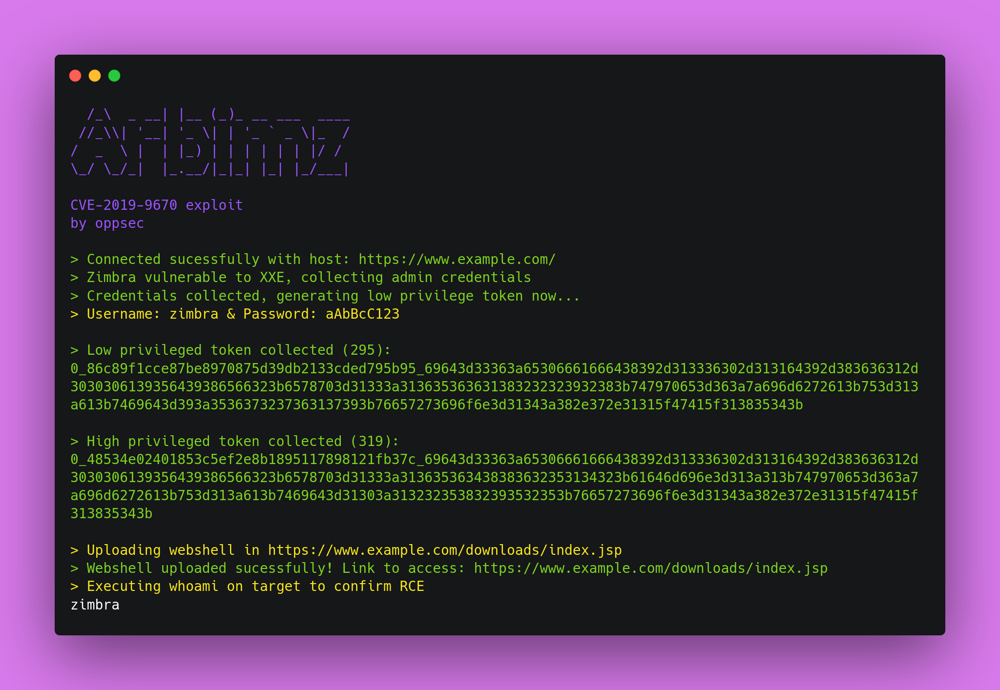

# 🕵️ Arbimz
> 🕵️ XXE in Zimbra Collaboration 8.7.X < 8.7.11p10

<div align="center">
    
</div>

<br>

<p align="center">
    
    
    
    
    
</p>

<br><br>

### 🕵️ What is Arbimz?
🕵️ **Arbimz** is a python tool created to exploit the vulnerability defined as CVE-2019-9670 (XXE in Zimbra Collaboration 8.7.X < 8.7.11p10)

<br><br>

### ⚡ Installing / Getting started

A quick guide of how to install and use Arbimz.

```shell
1. Clone the repository with git clone https://github.com/oppsec/arbimz.git
2. Install the libraries with pip3 install -r requirements.txt
3. Execute Arbimz with: python3 main.py --url https://example.com/
```

<br><br>

### ⚙️ Pre-requisites
- [Python 3](https://www.python.org/downloads/) installed on your machine.
- Install the libraries with `pip3 install -r requirements.txt`

<br><br>

### ✨ Features
- Fast scan & exploiter
- Low RAM and CPU usage
- Auto webshell upload
- Upload error handler

<br><br>

### 🔨 Contributing

A quick guide of how to contribute with the project.

```shell
1. Create a fork from Zebra repository.
2. Download the project with git clone https://github.com/your/arbimz.git
3. cd arbimz/
4. Make your changes.
5. Commit and make a git push.
6. Open a pull request.
```

<br><br>

### ⚠️ Warning
- The developer is not responsible for any malicious use of this tool.
